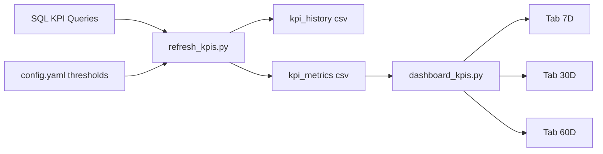

# KPI Alerts System Design (Pinned v1)

## Goal

Build a scalable KPI alerts dashboard that shows Red/Yellow/Green status by comparing current KPI values against dynamic thresholds computed from rolling history, with default daily evaluation and future weekly pivot support.

## Scope at This Stage

- Keep current local pipeline: SQL -> CSV -> Streamlit.
- Use daily KPI series as the primary computation grain.
- Add UI scope toggle for rolling windows: 7-day (default), 30-day, 60-day.
- Keep placeholder sections for Servicing/Call Center while Sales remains active.

## Current Architecture

- **Refresh pipeline**: [python/refresh_kpis.py](/Users/starsrain/2025_concord/py_loonie_perf_reporting/python/refresh_kpis.py)
  - Connects DB via pyodbc and executes SQL.
  - Writes raw daily output to `data/refresh/kpi_daily_metrics.csv`.
  - Writes serving snapshot to `data/refresh/kpi_metrics.csv`.
- **Dashboard**: [python/dashboard_kpis.py](/Users/starsrain/2025_concord/py_loonie_perf_reporting/python/dashboard_kpis.py)
  - Reads serving CSVs.
  - Renders Sales + Servicing skeleton + Call Center skeleton.
- **Threshold config**: [config/config.yaml](/Users/starsrain/2025_concord/py_loonie_perf_reporting/config/config.yaml)
  - Per-alert `mode` (`static` or `dynamic`) and threshold params.
- **SQL sources**: [sql/](/Users/starsrain/2025_concord/py_loonie_perf_reporting/sql)
  - `kpi_metrics.sql` (current aggregate source)
  - single-KPI scripts/procs (`AcceptCount`, `AcceptRate`, `ConversionRate`, `FPDFA`, etc.)

## Threshold Model (Design Baseline)

Given daily KPI series `x_t` and parameters from config:

- `rolling_mean_t`, `rolling_std_t` over `window` days
- seasonal stats by `month_day`
- `seasonal_zscore_t`
- bounds: `lower_threshold_t = rolling_mean_t - k * rolling_std_t`, `upper_threshold_t = rolling_mean_t + k * rolling_std_t`
- `pct_change_t`

Signals:

- `L` if `x_t <= lower_threshold_t`
- `U` if `x_t >= upper_threshold_t`
- `Z` if `|seasonal_zscore_t| >= z_score_lim`
- `P` if `|pct_change_t| >= percent_drop`

R/Y/G decision policy:

- **Static mode**: compare against lower/upper only.
- **Dynamic mode**: configurable policy (recommended: Yellow on 1 signal, Red on >=2 signals, Green otherwise).

## Data Contract Recommendation (SQL -> CSV)

Adopt a unified long format for serving snapshots (works for one-SQL-per-KPI):

- `metric_key`
- `section` (`Sales|Servicing|CallCenter`)
- `subcategory`
- `value`
- `window_days` (`7|30|60`)
- `as_of_date`
- `lower_threshold`
- `upper_threshold`
- `seasonal_zscore`
- `pct_change`
- `status`
- `link`

This avoids schema drift and simplifies UI filtering/tabs.

## Rolling Window UX Plan

- Add top tabs: `7D` (default), `30D`, `60D`.
- Tab selection filters rows by `window_days`.
- Same table structure across tabs; only values/alerts change.

## SQL Strategy Decision

Given your direction (single KPI SQL files):

- Keep each KPI query/proc independent.
- Refresh orchestrator executes each KPI query and appends normalized rows into one serving dataset.
- Do not append ad-hoc columns; append normalized rows only.

## Rollover Strategy

- **History file/table** (append-only): daily KPI facts.
- **Serving snapshot** (overwrite each run): latest 7/30/60 computed rows for dashboard.

## Implementation Phases

1. **Phase 1 (now)**: lock schema + 7/30/60 tabs + Sales thresholds from config.
2. **Phase 2**: wire Servicing KPIs to SQL and threshold logic.
3. **Phase 3**: wire Call Center KPIs and finalize alert policy.
4. **Phase 4**: scheduler hardening + optional Azure migration.

## Mermaid Flow

## Immediate Next Build Target

Implement threshold evaluation from `config.yaml` for Sales KPIs first, with 7D/30D/60D toggle in the dashboard and normalized serving schema ready for single-KPI SQL expansion.